# Trellis To-Do App Project

## Phase 1
- In our inital chat last week, we spoke about how we can benchmark different LLM's
- We also spoke about how we can't just use universal benchmarks like MMLU as it doesn't account for specific tasks one wants to do
- For this specific To-Do app, the only thing that matters for the agent is tool calling, narrowing the research to "which open-source model is the most reliable tool-caller that fits within my specs?"
- But first I had to learn what "trees" actually were to do the research
    - Binary Tree: In lamens terms, it is a data structure and each node can only branch into 2 sub nodes
    
    - Abstract Syntax Tree: In lamens terms, a syntax tree doesn't just use bigger or smaller numbers to coordinate data, instead it uses a string or equation to connect data, grammatical structure of code or an expression
        - BFCL uses it to grade a function call by parsing the call into that tree and comparing its structure (function name, argument names, values) against the expected one
    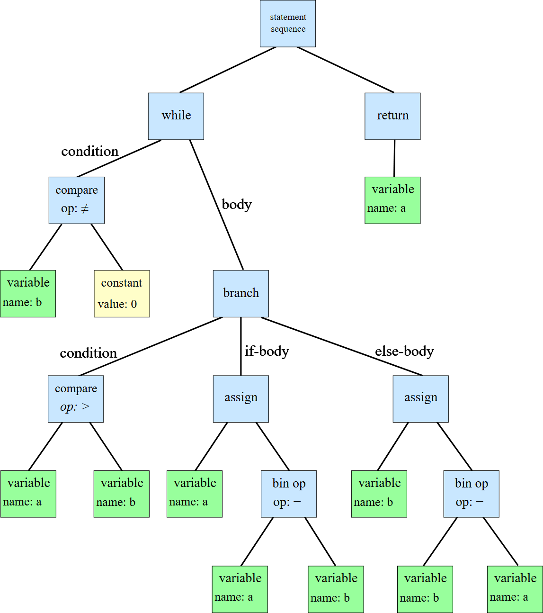
### Finding the best benchmark
- After understanding data trees, I found the Berkeley Function Calling Leaderboard (BFCL). Built to asses the tool calling capabilities, more speicifcally the ability to invoke functions using a syntax tree method with more than 2k questions
- A more indepth one rather than just straight tool calling is the tau-bench, which actually uses full conversations emulating whole conversations between a user and a agent, it tests based of natural language form humans, the ability to follow guidelines and rules. 

### So which model should I use?
- Considering my specs as im running this model locally (4070 super, ryzen 7700x, 32gb 6000mhz ram DDR5)
- From the two bench marks(only looking at fc benchmarks)

#### BFCL

- GLM-4.6 / Kimi K2 (FC) won't run on my machine
#### Tau(2)-Bench(even though for industry standards still helpful for learning)
- Proprietary (ceiling, cannot run locally):
    - Claude Sonnet 4.5: 88.1
    - GPT-5: 84.2
    - Gemini 2.5 Pro: 65.4
- Open source:
    - GLM-4.6: 75.9
    - Kimi K2-thinking: 75.2
    - DeepSeek V3.1: 42.8
    - Qwen3-32B: 41.5
- even the best models top out at 88
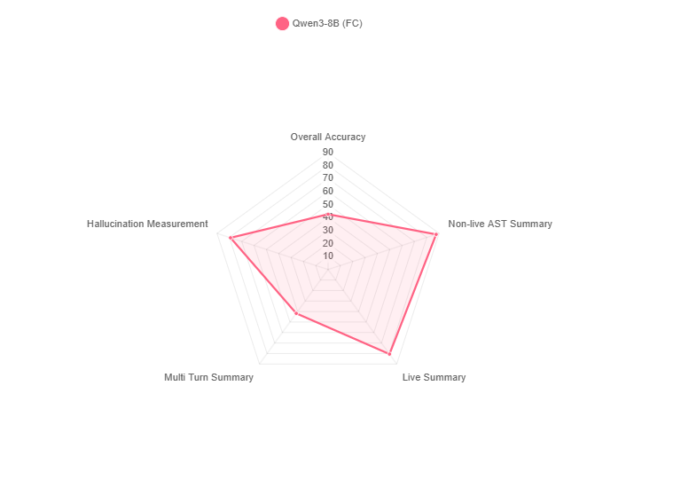
Berkeley Function Calling Leaderboard (BFCL): Patil et al., 2025, "The Berkeley Function Calling Leaderboard (BFCL): From Tool Use to Agentic Evaluation of Large Language Models," ICML 2025. https://gorilla.cs.berkeley.edu/leaderboard.html

tau-bench: Yao et al., 2024, "τ-bench: A Benchmark for Tool-Agent-User Interaction in Real-World Domains," arXiv:2406.12045. Successor tau2-bench: Barres et al., 2025, arXiv:2506.07982. Leaderboard at https://taubench.com

### But is it enough
- Because public leaderboards measure much harder, different tasks on someone else's hardware, so running our own benchmark is the only way to get real numbers for our specific to-do agent on our specific machine
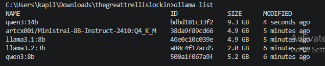
#### explaining the benchmark code
- The benchmark first starts with connecting to local Ollama through openai library which is pointed at the local host
- The makeTool takes a tool's name and descipriton, and returns it to the shape that ollama requires so the four tools get built the same way every time for consistancy
- models to test, one shared systemPrompt, a tools menu of 4 actions, and testCases (prompt paired with the tool that should fire, None means no tool)
- The ask function sends three things being the system prompt, the user prompt, and the tools menu, with a temperature of 0(greedy) making sure the answers are constiant and there are no outliers, then it checks if the model chose a tool and if so which one
- runs is set to 3 being how many times each prompt gets asked, so one lucky or unlucky answer doesnt decide the whole score
- For each model it first warms up with a throwaway "hi" so the loading time doesnt count, then starts a timer and asks every prompt 3 times, adding a point each time the model picks the correct tool
- At the end it works out the accuracy being correct out of total attempts, and the seconds it took, then prints them and saves everything to results.json
- So each model was benchmarked by asking it the same prompts several times and measuring two things, how often it picked the right tool (accuracy) and how long it took (speed)
#### results
- The original benchmark ran each prompt only once (runs = 1)
- The problem was that one prompt could decide a whole ranking, so a single lucky or unlucky answer would set the score and you couldnt tell a real result from a fluke
- To fix it I set runs to 3 so each prompt gets asked three times and every attempt counts towards the accuracy
- After running 3 times the accuracy came out exactly the same for every model (100, 75, 91.7, 66.7, 75), which showed the models were actually consistant at temperature 0 and the single run numbers were not luck after all
- The only real difference was the time, which roughly tripled (qwen3:8b went from about 40s to 102s, and qwen3:14b from 51s to 144s) since each prompt was now being asked three times instead of once
- So running it 3 times didnt change the ranking
- using qwen over llama cause accuracy is more important than time for a todo app
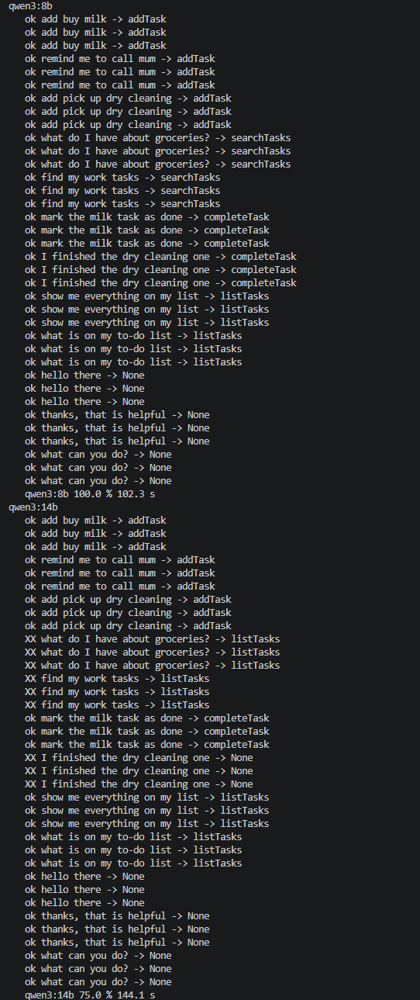
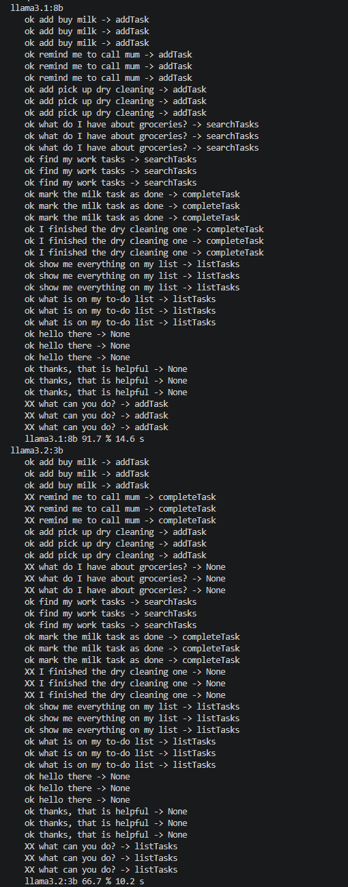
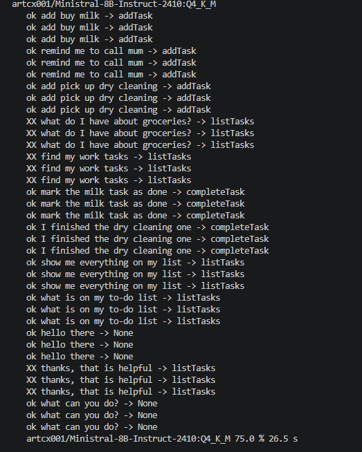

#### issues from phase 1
- Smooth sailing so far, just network download issues, simpliy reran
- ministral is not in ollamas official libary so had to use community uploads
- first prompt size was too small

## Phase 2
### Database setup
- I have a github student educaiton plan so I have alot of mongo db credits
- Refreshing my memory on vectors and semantics, a vector is a list of numbers that uses the meaning of text, a.k.a semantics, a embedding model turns "buy milk" into something like [0.12, -0.04, 0.88, ...] (hundreds of numbers). Texts with simalar meaning like the numbers get simular vectors so they sit close toghether allowing for optimal token retrival, semantic is just the act of searching by meaning, not exact words, so "grab milk" and "buy milk" come out close even though the letters differ. 
- Its different from scalar as it finds exact values not meaning, milk finds milk but not dairy, a set string, number, or a date.
- This to-do app would need to use scalar for the plain fields but vectors for the dedup and search. 

### why db
- need the tasks to actually save and store at the end of each session, without the db it will just reset, also db is needed to store each task as a id, the task itself, the status, the date created, and teh vector embedding(meaning used for dedup and semantic search)

### which embedding model
- the current quen3 8b model reads what the user says and picks a tool but it cant produce vectors for dedup and semantic search, to take text in and give a vector out to store in the database
- this time to benchmark embedding models I will see how good htey are at telling duplciates apart from non duplclicates

#### Online findings
- 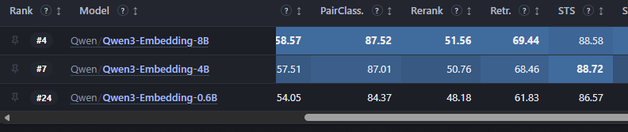
- 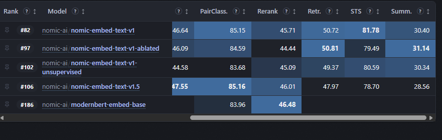
- 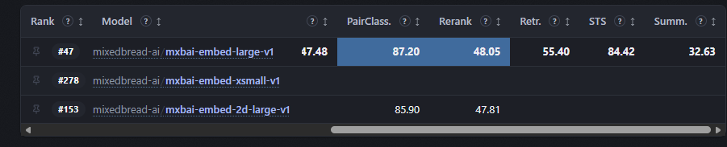
- 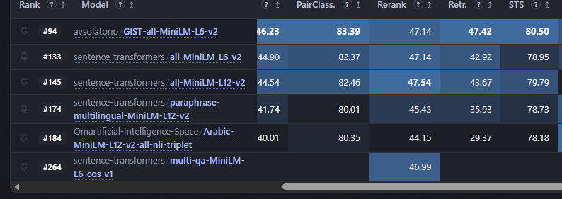
Retreived from https://huggingface.co/spaces/mteb/leaderboard 
- Same as phase 1, you cant just trust online leaderboards, MTEB pointed at big Qwen models but the task here is its own thing, so we benchmark on our own task
- MTEB's top models were 7 to 8B, too big for my 12GB card, and some had low zero shot scores
##### learning about zero shot
- The zero shot column on MTEB shows how much of the benchmark the model did NOT train on
- A low number (like 48%) means it trained on a big chunk of the benchmark, so its high score is partly inflated, not real skill
- A high number (like 95% for Qwen3 Embedding) means the score was earned on unseen data, so its more trustworthy
#### code explaination
- The benchmark first connects to local Ollama through the openai library pointed at the local host
- models is the list of embedding models being tested, small to large
- testCases is pairs of tasks, True if they are really the same task (a duplicate) and False if they are different
- threshold is the cutoff, if two tasks score this similar or higher we count them as a duplicate
- The embed function turns one piece of text into its vector, the numbers that hold its meaning
- The cosine function takes two vectors and gives how close they are, 0 is different and 1 is identical
- For each model it warms up, then for every pair it embeds both texts, gets the similarity, and guesses duplicate if its above the threshold, adding a point each time the guess matches the label
- It keeps the duplicate scores and the non duplicate scores separate so it can show each average, and the bigger the gap between them the cleaner the model separates duplicates from different tasks
- At the end it works out accuracy and the two averages, prints them and saves to results2.json
- So each model was benchmarked by giving it pairs of tasks and measuring how well its similarity tells real duplicates apart from different ones
#### results
- basically all llms got 100 percent accuracy but the true test was in the displacement in teh data, mini lm came out on top
- It is also the smallest and fastest, and only 384 dims so the cheapest to store in the database
- Qwen3 Embedding 4b also hit 100% but a smaller gap (0.38) for way more size
### setting up mongodb
- already have credits from a prev hackathon
- making a cluster and setting my ip adress to the ip adress list so I can access it 
- made a script and setup a env, the script just connects to atlas thru the connection string.
- load_dotenv gets the secret connection string from the .env
- MongoClient connects to the cluster
- the database (todo) holds the collection (tasks) which holds the documents
- insert_one adds a task, find reads them back
- the database and collection are made on the first write
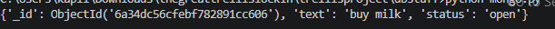
- made 4 new functions to add tasks, complete tasks, delete tasks, list tasks, right now there is no harness calling it, later there will be just placeholder to see if it works
### actually make it vector for ddups and searches
- The embedding model (all-minilm) turns each task into 384 numbers that capture its meaning, so the app can spot duplicates and search by meaning even when the wording is different
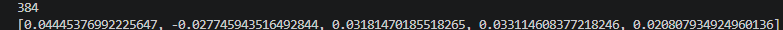
- called the embed function into mongo.py to embed the text parameter
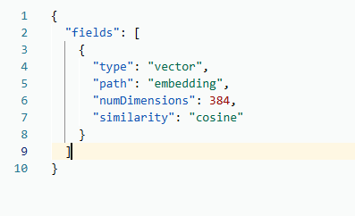
- searchTasks embeds your search words into a vector and finds the stored tasks closest to it in meaning
- it returns the top few matches each with a score showing how close they are
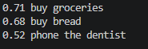
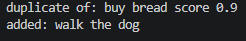
- closestTask finds the most similar existing task and its score, and if it is 0.85 or higher the task is treated as a duplicate and not added
- the embedding benchmark showed a wide gap duplicates about 0.8, different tasks about 0.25
-the 0.85 was based off this, from the search tests as well it was found that different tasks scored from 0.5 to 0.7, knowing it must be higher and the bread simalarity scored 0.9, 0.85 was the sweet spot

## Phase 4
### What orchestrator?
- I want to be more impressive so I am choosing langchain over a sdk
- using landchain also cause it has nice ollama integration
- using chatollama
### setting up agents.py
- using chatollama for simplicity
- setting temp to 0 as you don't want the agent to be creative when embedding and making set predefined to-do tasks
    - A bit of learning, a temperature of 0 uses greedy encoding, meaning it just picks the most likely response next, the same as k-nearest-neighbours top k=1(choosing the top 1 most likely next words) comapred to top-p with temperature it takes teh sum of probabiltiies then only chooses words within that range.
- in mongo.py added prompts to each tool so the agent can call it, then switched all prints to a return, closestTask doesnt need it because its a helper call not a tool call
    - addTask: adds a task, or returns "duplicate of" if one too similar already exists
    - listTasks: returns every task with its status
    - completeTask: marks a task as done and returns a confirmation
    - deleteTask: removes a task and returns a confirmation
    - searchTasks: returns the tasks closest in meaning to the query
    - closestTask: helper (not a tool) that finds the single most similar task, used by the others
- chatollama runs qwen3 8b locally
- wraped the five functions as tols
- create_agent ties the model and tols together so it piks the tool itself from plain chat. theres a little while loop to type messages and result grabs the agents final reply
#### issue
- bug: complete and delete used exact text match
- so "bread" never matched "buy bread", nothing changed
- but the function still returned marked done, so it looked like it worked
- noticed cause bread was still open in the list after
- sent complete and delete through closestTask like addTask
- addTask was printing the duplicate message instead of returning it, so the agent never saw it and claimed it added a dupe. fixed it to return
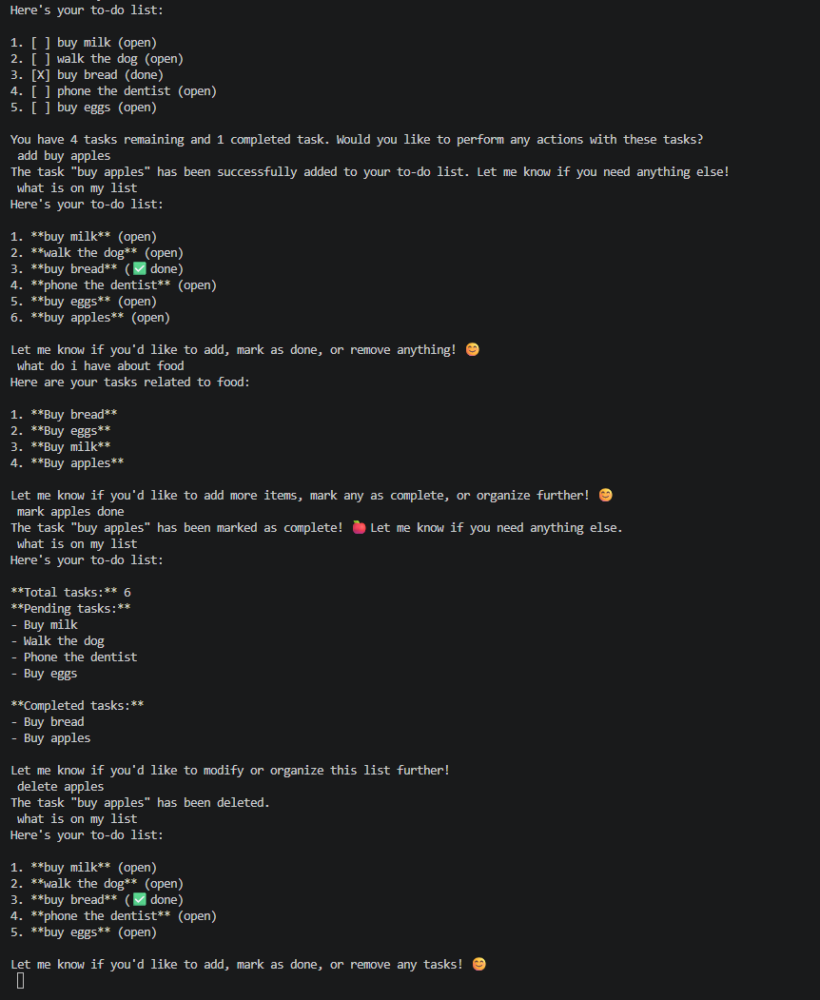
- should add system prompt format shouldnt be different every single time
- system prompt made, made a search simalrity for the vector at 0.65 forgot to add that before
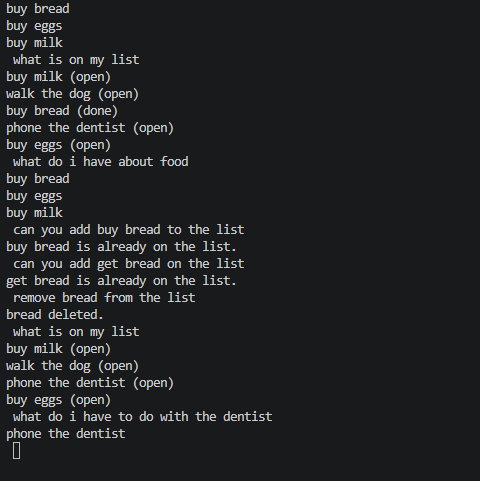
- this is the result with the system prompt, much better

### Phase 5
#### Integrations
- the structure will be my agent which then goes to like a chat gpt(exfast) which then connects to my front end, discord, slack, and whatsapp
- first need to extract the agent into a chat function with FastAPI alongsidew a /chat endpoint
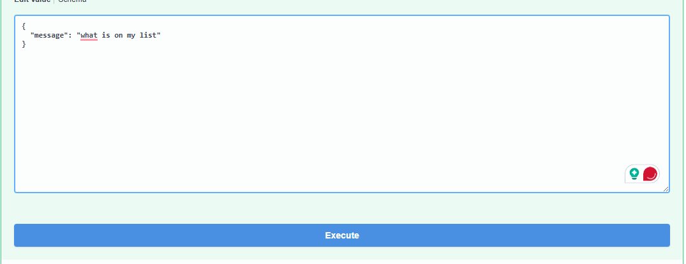
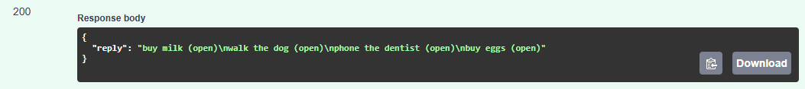
##### Discord
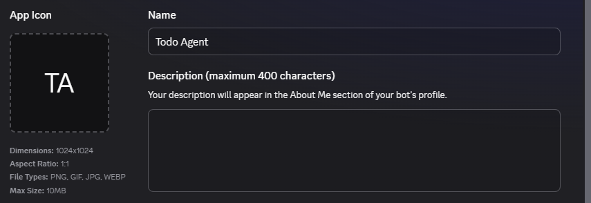
- added message content intent and send messages and read message history bot intent

##### Frontend barebones
- integration buttons inspired by trellis, essentially so people can easily make whatsapp slack and discord integrations with it. 
##### slack
- made thru manifest
- bot runs over socket mode so no tunnel needed, answers DMs and @mentions. also wired the real "add to slack" oauth install flow (uses ngrok for the callback)
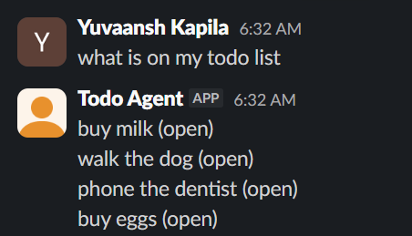
##### Whatsapp
- hooked up through twilios sandbox, incoming texts hit a webhook over ngrok and the agent replies back on whatsapp
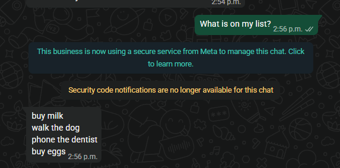